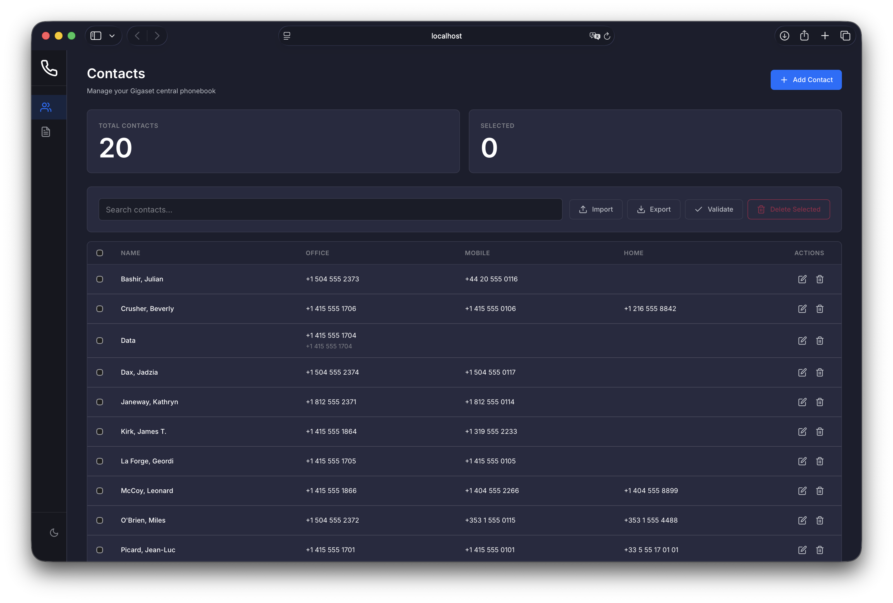

# Gigaset Central Phonebook

A web-based phonebook management server that generates XML phonebook files for Gigaset DECT phone systems. Features a responsive web UI for managing contacts and serves the phonebook XML directly to Gigaset devices.



## Compatible Devices

- Gigaset N870/N870E IP PRO (up to 2000 entries)
- Gigaset N770 IP PRO (up to 2000 entries)
- Gigaset N670 IP PRO (up to 2000 entries)
- Gigaset N610 IP PRO (up to 2000 entries)
- Gigaset N530 IP PRO (up to 500 entries)

## Features

- **Web UI** - Responsive, mobile-friendly interface for managing contacts
- **Phone Number Formatting** - Automatic conversion of international numbers (+49...) to local dial format (0...)
- **vCard Import** - Import contacts from `.vcf` files (supports vCard 3.0/4.0)
- **JSON Import/Export** - Backup and restore phonebook with merge or replace options
- **Phonebook Validation** - Detect entries without phone numbers and duplicate numbers
- **XML Endpoint** - Serves Gigaset-compatible XML at `/phonebook.xml`
- **Authentication** - Optional HTTP Basic auth for the web UI
- **Docker Support** - Ready-to-use Docker and Docker Compose configuration

## Setup

### Prerequisites

- Node.js 18+ **or** Docker

### Option 1: Docker Compose (Recommended)

```bash
docker-compose up -d
```

To stop:

```bash
docker-compose down
```

### Option 2: npm

```bash
npm install
npm start
```

The server starts at http://localhost:3000

## Configuration

| Variable    | Description                    | Default |
| ----------- | ------------------------------ | ------- |
| `PORT`      | Server port                    | `3000`  |
| `AUTH_USER` | Basic auth username (optional) | -       |
| `AUTH_PASS` | Basic auth password (optional) | -       |

Set these in your environment or in `docker-compose.yml`.

## Usage

### Web Interface

Open http://localhost:3000 to manage contacts:

- Add, edit, and delete contacts
- Import contacts from vCard or JSON files
- Export phonebook as JSON backup
- Validate phonebook for issues

### Phone Number Formatting

Some Gigaset devices may not support dialing numbers with the + prefix. The Settings page allows you to enable automatic phone number conversion:

- **Local numbers**: `+4917612345678` → `017612345678` (country code replaced with 0)
- **International numbers**: `+34609123456` → `0034609123456` (+ replaced with 00)

Configure your local country code in Settings to ensure local numbers are converted correctly. Existing contacts can be bulk-converted using the "Apply to Existing Entries" button.

### Gigaset Device Configuration

Configure your Gigaset device to fetch the central phonebook from:

```
http://<your-server-ip>:3000/phonebook.xml
```

Refer to your device's administration guide for the exact setting location (typically under **Settings > Telephony > Central Phonebook**).

## Phonebook Constraints

- Maximum 2000 entries (500 for N530)
- Maximum 2MB file size
- Name fields limited to 32 characters each
- Up to 6 phone numbers per contact (2 office, 2 mobile, 2 home)

## License

MIT
